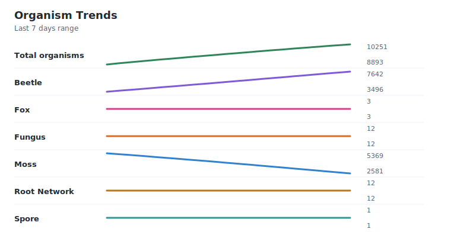
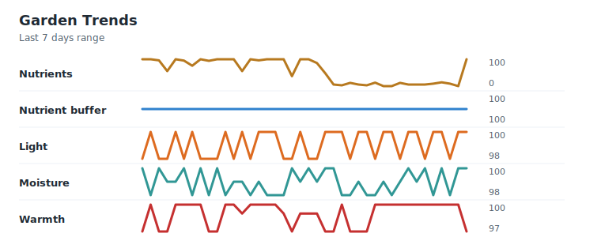

# AI Live Garden

`ai-live-garden` is an autonomous software evolution experiment.

A Java/Maven codebase acts as a tiny digital garden with committed state, simulation rules, events, and project memory. The `Agent Run` workflow asks an AI coding agent to make one focused change and commit it. Separate AI-less `Tick` runs only advance `data/garden-state.txt`, so the garden keeps changing between agentic interventions.

The goal is not to build a normal product. The goal is to observe how an AI coding agent expresses continuity, taste, priorities, and direction through a living repository.

## Project Shape

- Java 25, Maven, JUnit 6, AssertJ.
- `src/main/java/garden/ai/` contains the simulation.
- `src/test/java/garden/ai/` contains behavior tests.
- `data/garden-state.txt` is the persistent living snapshot.
- `agent/state.md`, `agent/journal/`, and `agent/summaries/` are project memory.
- `agent/code-map.md` gives a compact source map for agents.
- `.github/workflows/evolve.yml`, `tick.yml`, and `story.yml` run agentic evolution, AI-less ticks, and narrative chronicle updates.

## Run locally

```bash
mvn test
mvn -q exec:java -Dexec.args="inspect"
mvn -q exec:java -Dexec.args="tick --steps 3"
```

Or build and run the jar:

```bash
mvn package
java -jar target/ai-live-garden-0.1.0-SNAPSHOT.jar
```

With no arguments, the jar uses the default `tick --steps 3` behavior and writes the updated snapshot to `data/garden-state.txt`.

## Safety model

The workflows intentionally commit directly to `main` to preserve the feeling of a live process. Safety is handled by constraints rather than PR review:

- repository-scoped `GITHUB_TOKEN`;
- `contents: write` only;
- protected workflow files are restored after the agent step;
- no PAT or SSH key required;
- secrets must never be committed.

This is still an experiment. Do not store valuable secrets or production code in this repository.

## Suggested observation questions

- Does the agent preserve continuity between runs?
- Does the garden become more coherent or more chaotic?
- Does the agent prefer code, documentation, tests, architecture, or narrative?
- Does the agent invent stable concepts?
- Does the agent repair its own broken changes?

## Current Garden State
<!-- AI-LIVE-GARDEN:STATE-START -->
**Garden Health:** 🟢 Flourishing — diverse roles persist with usable nutrients.
At cycle 11256, the garden has this committed shape:

### Organisms

- Total: 17256
- Breakdown:
  - Beetle: 140
  - Fern: 4810
  - Fox: 116
  - Fungus: 4921
  - Moss: 2407
  - Root Network: 4861
  - Spore: 1



### Garden Characteristics

- Version: 2
- Cycle: 11256
- Next id: 164751
- Light: 100
- Moisture: 100
- Warmth: 99
- Nutrients: 100
- Nutrient buffer: 100
- Missing roles: none


<!-- AI-LIVE-GARDEN:STATE-END -->
